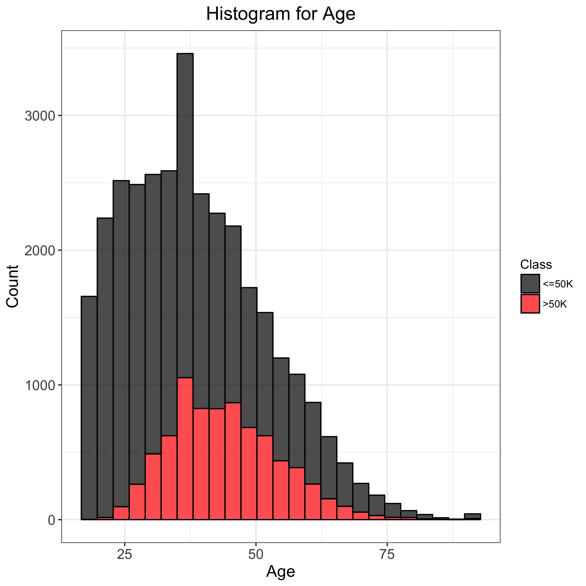
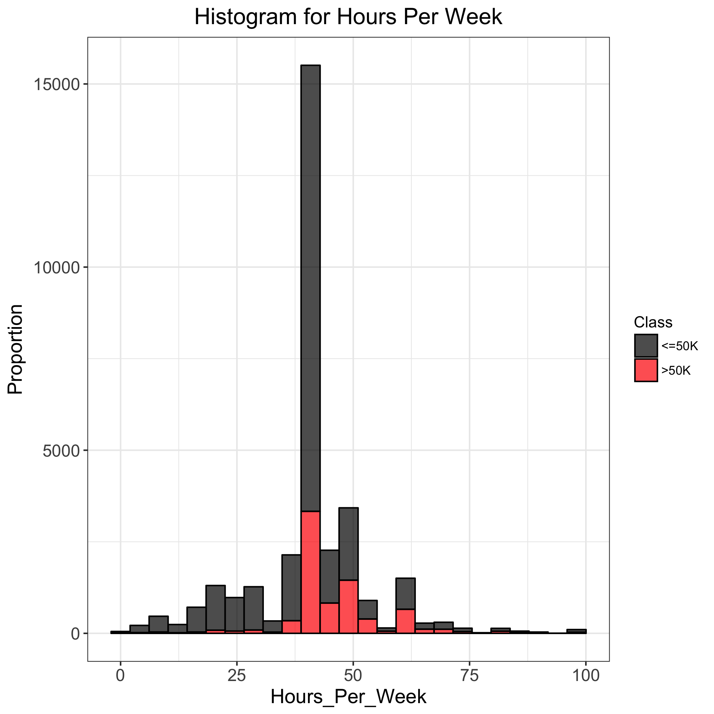
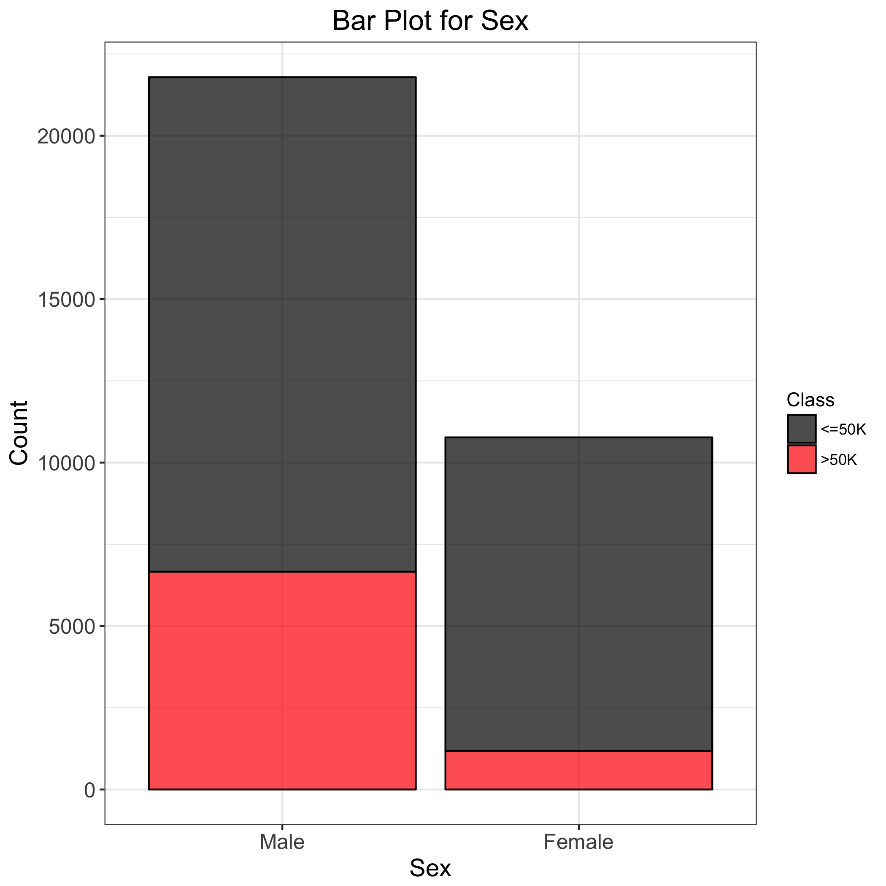
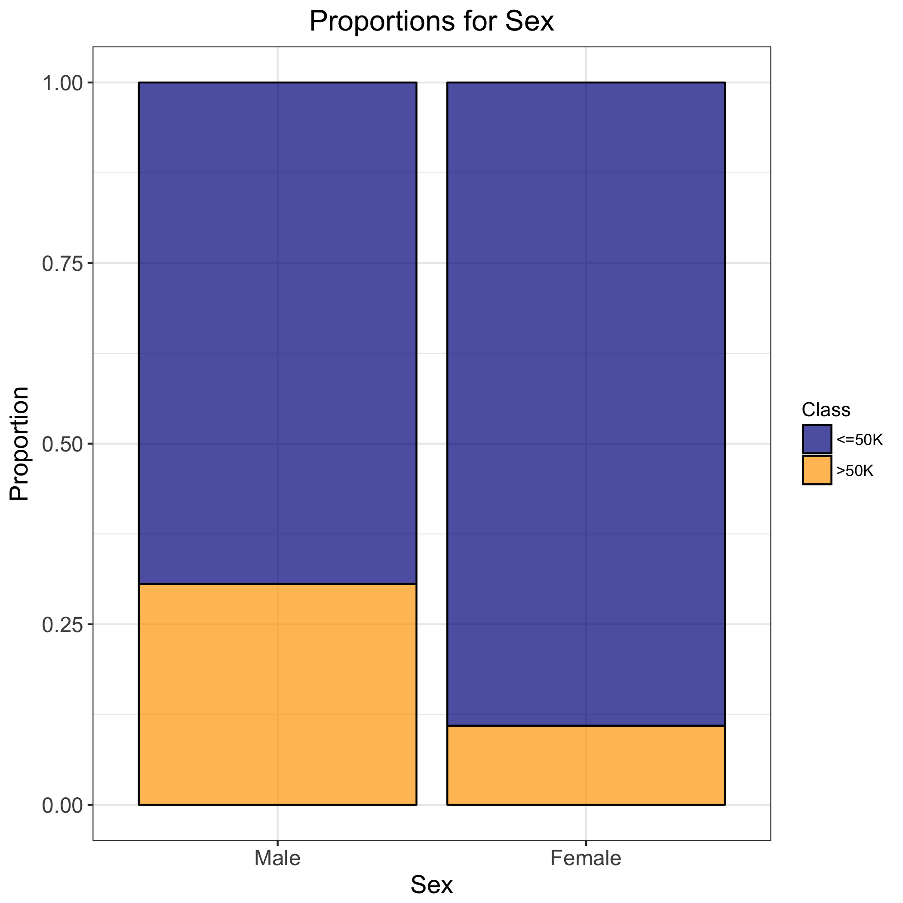
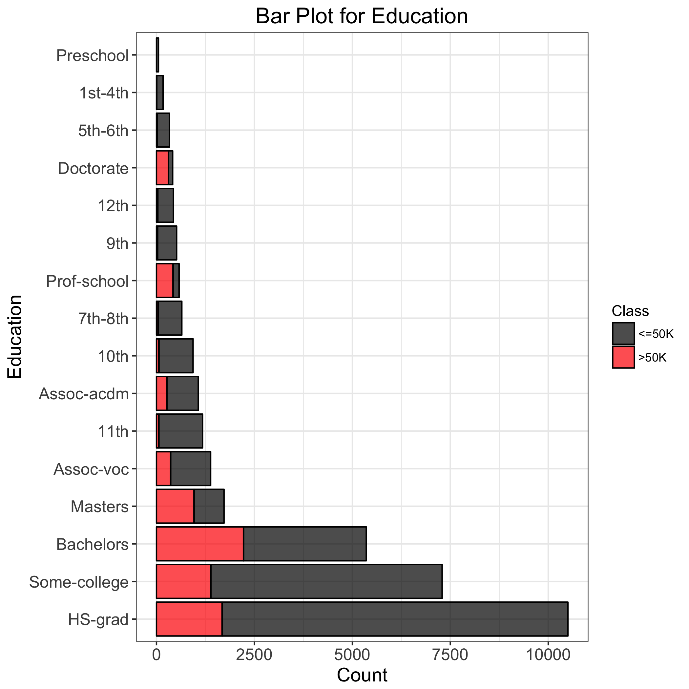
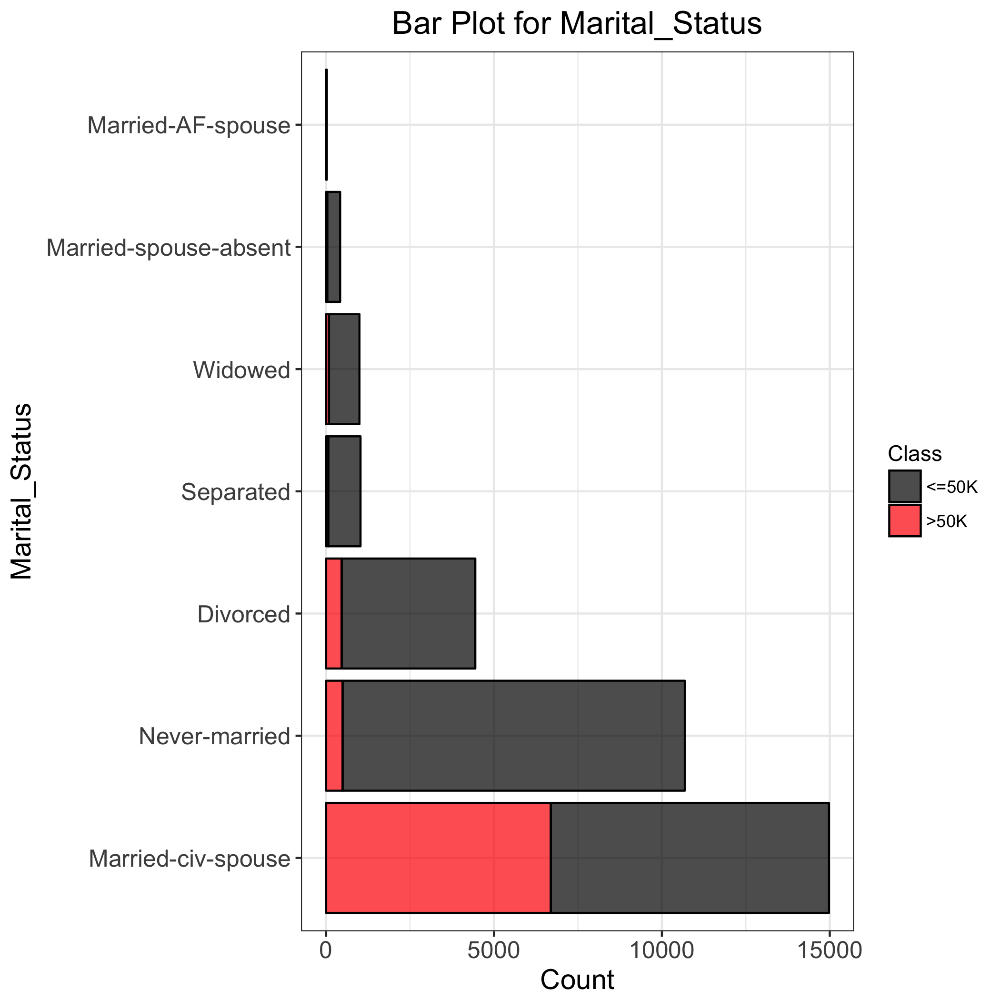
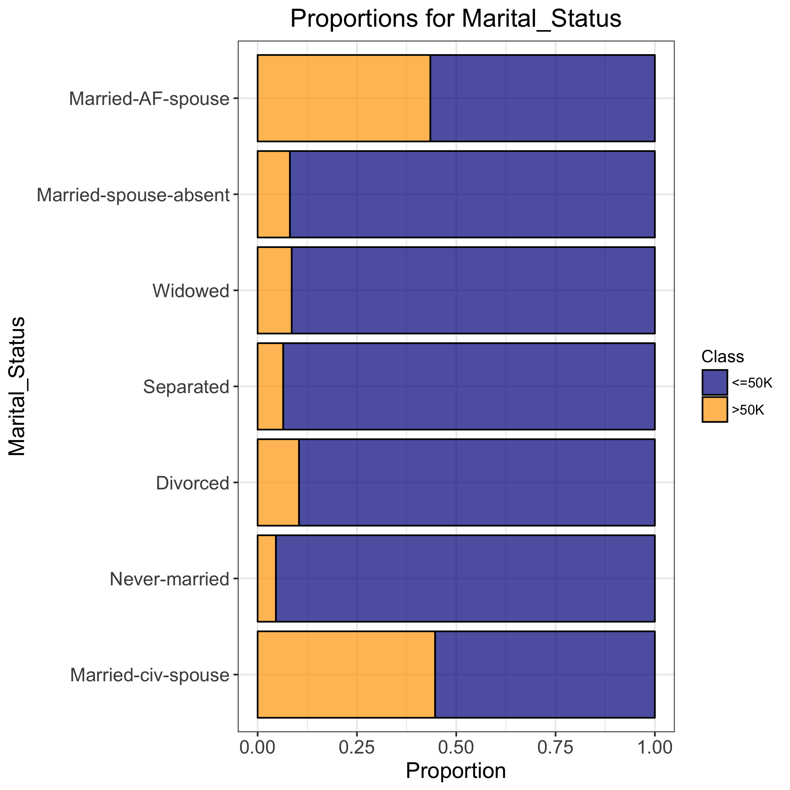
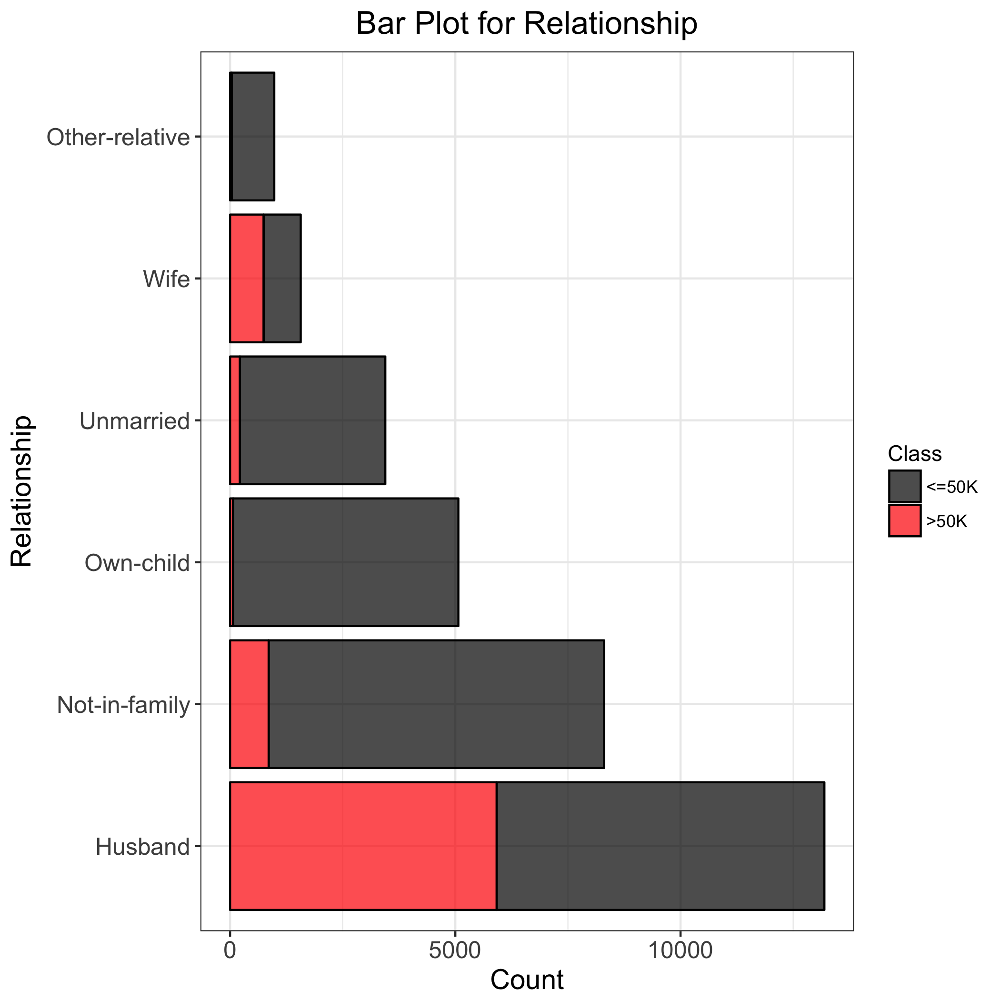
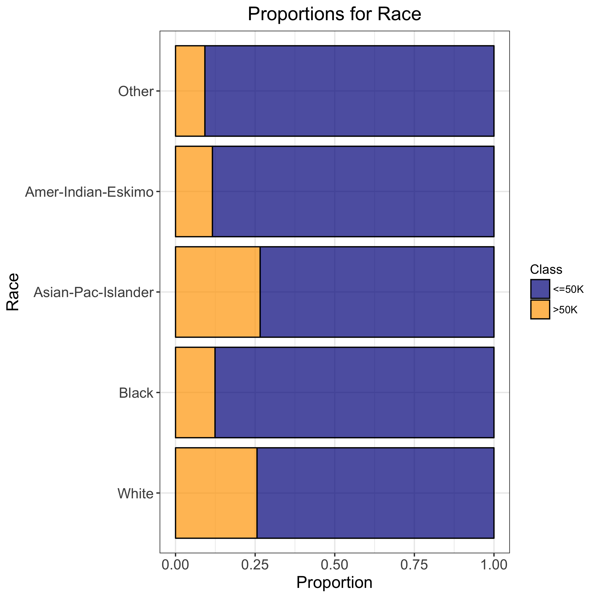
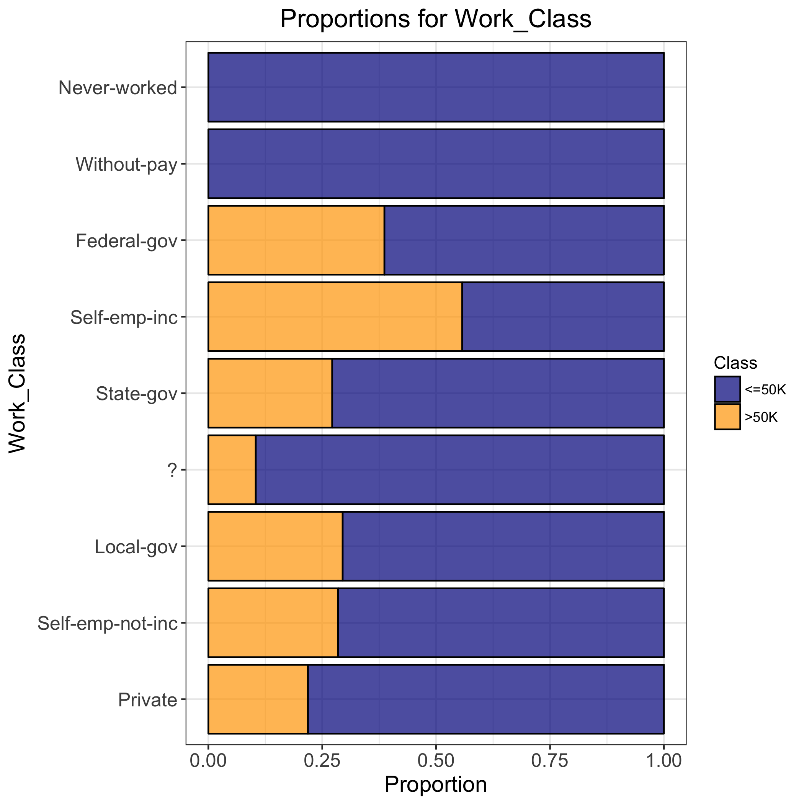

<style>

.middle {
text-align: center;
}

</style>

```{r setup, include=FALSE}
knitr::opts_chunk$set(echo = FALSE)
```


```{r, message=FALSE, warning=FALSE}
library(tidyr)
library(dplyr)
library(readr)
library(rmarkdown)
library(yaml)
library(knitr)
```

## Introduction

Adult Dataset from UCI Machine Learning Repository. Also known as "Census Income" dataset. It is used to predict whether a person's income exceeds $50K/yr based on census data. For this project I will be using some Feature Selection techniques and develop a model that can correctly classify the  `salary-class`(greater than or less than $50k) a person. The features of each person provided in the dataset are `age`, `workclass`, `final-weight`, `education`, `education-number`, `marital-status`, `occupation`, `relationship`, `race`, `sex`, `capital-gain`, `capital-loss`, `hours-per-week` and `native-country` ?


## Raw Data Obtained

A quick look at the data obtained from the UCI Machine Learning Reposiotry:

```{r}
raw_data <- read.csv("../data/train.csv")
print(head(raw_data, 2))
```

## Summary of Continuous Variables

Statistical summary of all the continious variables from the dataset:

```{r}
summary_df <- read.csv("../doc/data_summary.csv")
print(summary_df)
```


## Data Visualizations

### Analysis of Age Variable

<div class = "middle">


</div>

The number of people who earns more than $50,000 increases from the age of 25 to a maximum number of people at around the age of 35.
About 40% of the people aged around 50 earn above $50,000.


### Analysis of Hours Per Week Variable

<div class = "middle">


</div>


About 40% of the people who work about 45-60 hours a week earn more than \$50,000. Only a small proportion of the people who work below 45 hours earn more than \$50,000. Strangely, about 20% of the people who work close to 0 hours a week earn more than \$50,000.

### Analysis of Sex Variable

<div class = "middle">


</div>

The number of records for `Male` is double than that of `Female`. The proportion of female who earn more than $50,000 is less than one-third of that of the male population.

### Analysis of Education Variable

<div class = "middle">


</div>

The ratio of people who earn more than \$50,000 increases with their level of education. The proportion of people who earn more than \$50,000 is the people who have `Doctorate`, and it is closely followed by people who went to `Professional school`. Following this trend, the proportions of people who have not completed High school is very low.

### Analysis of Marital Status Variable

<div class = "middle">



</div>

About 15,000 people from the population have a marital status of `Married-civ-spouse`, and about 45% of the people in this group earn more than \$50,000. The next largest group in this section is `Never-married`, closely followed by `Divorced`; and only a small proportion of these groups earn above \$50,000.

### Analysis of Occupation Variable

<div class = "middle">


</div>

Among the larger groups, about 50% of the people working as Professional Speciality and Executive Managerial earn above \$50,000. One of the larger groups with the lowest proportion is `Other-services`. Only a small proportion of less than 10% get paid more than \$50,000.

### Analysis of Family Relationship Variable

<div class = "middle">


</div>

When the sample is classified based on their relation,a higher proportion of `Wives` earn more than $50,000 than any other relation. This is closely followed by `Husband`. However, it should also be noted that the number of wives in the sample is much smaller when compared to husbands.

### Analysis of Race Variable

<div class = "middle">


</div>


The races with the higher proportion of salaries are `White` and `Asian-Pac-Islander` at about 25%, and other races have a proportion of about 10%. But it should be noted that there are only a few hundred people in the `Asian-Pac-Islander` group.

### Analysis of Work Class Variable

<div class = "middle">


</div>


Majority of the people work in `Private` sector and about one-fourth of the people earn above \$50,000. The highest proportion of people who earn above \$50,000 are Self Employed. This is closely followed by `Federal-gov` and then `State-gov`.

### Feature and Model Selection

#### Binary Encoding of Variable

The dataset had a total of 15 features and 9 of them were categorical variables. These categorical variables had to be encoded into binary. Since the distance between different levels of each category cannot be assumed to be the same I opted to use Binary encoder instead of the Label encoder from sklearn. After converting all the variables, there were totally 106 continuous/ binary variables.

#### Logistic Regression Models with L1 and L2 Regularisation

<div class = "middle">


</div>

The figures above show the variation in the score for L1 and L2 models for various values of C.

When using a using a Logistic Regression Model with L2 regularization, I obtained a maximum training score of 80 and a validation score of 79. Whereas when using a Logistic Regression Model with L1 regularization I obtained a maximum training score of 85 and a validation score of 84. 

By performing CrossValidation the optimum value for C was identified as 100 and when an L1 regularized model was fitted on the entire training data, I obtained a training score and test score of 85.

### Random Forest Model

<div class = "middle">

</div>

The figure above shows the variation in the score for varying maximum depths of Random forest classifier.

```{r}
cm <- matrix(c(11604, 1629,831, 2217), nrow = 2)


colnames(cm) <- c("Actual Less than 50", "Actual More than 50")
rownames(cm) <- c("Predict Less than 50", "Predict More than 50")

print(cm)
```

The maximum depth for the Random forest was obtained as 16 by using GridSearchCV. For the given model I was able to obtain maximum training score of 88% and testing Score of 86%. Therefore the value obtained using Random Forest Classifier is marginally better than the one obtained using L1 Regularized Logistic Regression Model. The results obtained using the Random Forest Classifier have been reported above in a confusion matrix. 

## Result

For the Income Prediction project, two models were obtained which classified the test data with good accuracy. The L1 regularized Linear Regression Model obtained a score of 85, and the Random Forest Classifier performed slightly better at 86 percent.